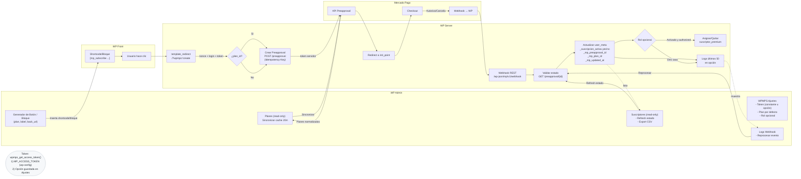

# Mercadopago plugin para wordpress (by Devecoop)

Plugin de WordPress para suscripciones automáticas con Mercado Pago (Preapproval): shortcode/botón en WP → creación de preapproval → checkout/autorización en MP → webhook de validación → actualización de acceso en WP.

Requisitos: PHP ≥ 7.4, WordPress ≥ 6.0. El token no se guarda en el repo; definalo en `wp-config.php` como `MP_ACCESS_TOKEN`.

## Arquitectura

## Estructura del repo

- `src/`: contenido exacto del plugin que se empaqueta
- `outputs/`: artefactos `.zip` (ignorado en git)
- `make_zip.sh`: script de empaquetado reproducible
- `.gitignore`: ignora `outputs/`, `*.zip`, `.DS_Store`, `.idea/`, `node_modules/`
- `LICENSE`: GPL-2.0-or-later

Dentro de `src/`:
- `wp-mp-subscriptions.php`: archivo principal (header completo + carga i18n)
- `includes/class-mp-client.php`: cliente de API de MP (preapproval)
- `includes/routes.php`: endpoint webhook `/wp-json/mp/v1/webhook`
- `includes/helpers.php`: utilidades de logging
- `includes/settings.php`: página mínima de ajustes (opcional)
- `languages/`: carpeta para archivos de traducción
- `readme.txt`: readme simple de WP

## Variables y secretos

- Access Token de MP (dos opciones):
  - Recomendado en entornos administrados: definir en `wp-config.php` (server-side):
    `define('MP_ACCESS_TOKEN', 'APP_USR-xxxxxxxx');`
  - Alternativa sin acceso a código: configurarlo en el plugin desde `Ajustes → WPMPS` (se guarda en la base y se usa sólo si no hay constante definida).

## Endpoints

- Trigger interno (GET): `/?wpmps=create&amount=...&reason=...&back=...` (protegido por nonce) → crea preapproval y redirige a MP.
- Trigger con Plan (GET): `/?wpmps=create&plan_id=PREAPPROVAL_PLAN_ID&reason=...&back=...` → crea un preapproval basado en un plan existente y redirige a MP (con `back_url`).
- Webhook (POST): `/wp-json/mp/v1/webhook` → revalida contra API de MP y setea `user_meta` `_suscripcion_activa` (`yes|no`).

## Instalación

1) Definir `MP_ACCESS_TOKEN` en `wp-config.php`.
2) Ejecutar `./make_zip.sh` (genera `outputs/wp-mp-subscriptions-<version>-<fecha>.zip`).
3) En WP: Plugins → Añadir nuevo → Subir plugin → Activar.
4) En Mercado Pago: configurar webhook a `https://TU-DOMINIO/wp-json/mp/v1/webhook`.
5) Insertar el shortcode en una página: `[mp_subscribe amount="10000" reason="Club de Descuentos" back="/suscribirse/resultado"]`.
   - Con Plan: `[mp_subscribe plan_id="PREAPPROVAL_PLAN_ID" reason="Club de Descuentos" back="/suscribirse/resultado"]`.
   - También podés definir un “Plan ID por defecto” en Ajustes → WPMPS y usar sólo `[mp_subscribe back="/resultado"]`.

## Uso

- Requiere usuario logueado.
- Parámetros del shortcode: `amount` (monto), `reason` (descripción), `back` (URL de retorno), `currency` (default `ARS`).

## Seguridad

- HTTPS obligatorio; token sólo en servidor (`MP_ACCESS_TOKEN`).
- `X-Idempotency-Key` en POST a MP.
- Revalidación vía API en el webhook.
- Sin almacenamiento de tarjetas/PII sensible; logging sin secretos (`WP_DEBUG_LOG`).

## Testing

- Alta → autorización → webhook → `user_meta _suscripcion_activa = yes`.
- Cancelación/pausa → webhook → `user_meta _suscripcion_activa = no`.

## Operación

- Logs: `wp-content/debug.log` con `WP_DEBUG_LOG` activo.
- Cancelaciones: gestionar desde el panel de Mercado Pago.

## Troubleshooting

- 401/403: revisar permisos del endpoint y autenticaciones de hosting/WAF.
- Token inválido: verificar `MP_ACCESS_TOKEN` en `wp-config.php`.
- Webhook sin `id`: MP puede enviarlo en query `?id=` o en `body.data.id`.
- Timeouts: ajustar `timeout` en cliente de MP o revisar red.

## Roadmap

- Dashboard admin de suscriptores; export CSV; soporte por adapters a otros gateways.

## Changelog

- 0.2.0: Modo low-code: menú admin con pestañas (Planes, Botones, Suscriptores, Logs), sincronización de planes (cache), generador de shortcodes, export CSV, logs y reproceso, block Gutenberg “MP Subscribe Button”, settings con rol opcional y badge de entorno. Soporte `plan_id` en shortcode y plan por defecto.
- 0.1.1: Header con branding/links/i18n; página mínima de Ajustes; LICENSE; README actualizado.
- 0.1.0: Versión inicial funcional (shortcode, preapproval, webhook).
