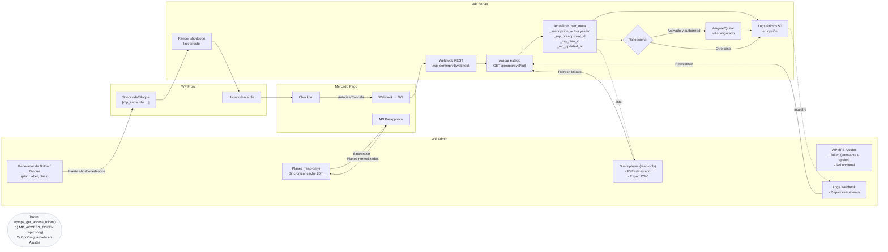

# Mercadopago plugin para wordpress (by Devecoop)

Plugin de WordPress para suscripciones automáticas con Mercado Pago (Preapproval): shortcode/botón en WP → link directo al checkout de MP → webhook de validación → actualización de acceso en WP.

Requisitos: PHP ≥ 7.4, WordPress ≥ 6.0. El token no se guarda en el repo; definalo en `wp-config.php` como `MP_ACCESS_TOKEN`.

## Docs rápidas

- Diagrama de flujo: `docs/flow.md`
- Guía de logs: `docs/logs.md`

## Arquitectura

## Estructura del repo

- `src/`: contenido exacto del plugin que se empaqueta
- `outputs/`: artefactos `.zip` (ignorado en git)
- `make_zip.sh`: script de empaquetado reproducible
- `.gitignore`: ignora `outputs/`, `*.zip`, `.DS_Store`, `.idea/`, `node_modules/`
- `LICENSE`: GPL-2.0-or-later

Dentro de `src/`:
- `wp-mp-subscriptions.php`: archivo principal (header completo + carga i18n)
- `includes/class-mp-client.php`: cliente de API de MP (preapproval)
- `includes/routes.php`: endpoint webhook `/wp-json/mp/v1/webhook`
- `includes/helpers.php`: utilidades de logging
- `includes/settings.php`: página mínima de ajustes (opcional)
- `languages/`: carpeta para archivos de traducción
- `readme.txt`: readme simple de WP

## Variables y secretos

- Access Token de MP (dos opciones):
  - Recomendado en entornos administrados: definir en `wp-config.php` (server-side):
    `define('MP_ACCESS_TOKEN', 'APP_USR-xxxxxxxx');`
  - Alternativa sin acceso a código: configurarlo en el plugin desde `Ajustes → WPMPS` (se guarda en la base y se usa sólo si no hay constante definida).

## Endpoints

- Shortcode/Bloque: genera un enlace directo a Mercado Pago usando el `preapproval_plan_id` definido en el shortcode o bloque.
- Webhook (POST): `/wp-json/mp/v1/webhook` → revalida contra API de MP y setea `user_meta` `_suscripcion_activa` (`yes|no`).

## Instalación

1) Definir `MP_ACCESS_TOKEN` en `wp-config.php`.
2) Ejecutar `./make_zip.sh` (genera `outputs/wp-mp-subscriptions-<version>-<fecha>.zip`).
3) En WP: Plugins → Añadir nuevo → Subir plugin → Activar.
4) En Mercado Pago: configurar webhook a `https://TU-DOMINIO/wp-json/mp/v1/webhook`.
5) Insertar el shortcode en una página: `[mp_subscribe plan_id="PREAPPROVAL_PLAN_ID" label="Suscribirme" class="wp-mps-btn"]`.

## Configuración en Ajustes → MP Subscriptions

- URL de Webhook: sólo lectura; úsala para configurar el webhook en Mercado Pago (botón Copiar incluido).
- Access Token de Mercado Pago: credencial de servidor. Si existe la constante `MP_ACCESS_TOKEN`, el campo queda solo lectura y la constante tiene prioridad; el botón con “ojito” permite ver el valor temporalmente mientras editás.
- Dominio de MP (Link): dominio base del checkout de suscripciones (`secure.mercadopago.com`, `mercadopago.com.ar`, etc.). Se usa al construir la URL que abre el botón.
- Rol asignado al usuario cuando se confirme la suscripción: seleccionar entre los roles editables de WordPress. Dejá “No cambiar el rol actual” para desactivar la asignación automática.

Ejemplo: si elegís el rol `subscriber`, cuando Mercado Pago marque una suscripción como `authorized` el usuario recibirá ese rol; si luego el webhook informa `paused` o `cancelled`, el rol se quitará automáticamente.

## Uso

- Requiere usuario logueado. Si no hay sesión, se muestra CTA a login con redirect y se registra evento de log.
- Shortcode `[mp_subscribe ...]`:
  - plan_id: ID del plan de MP (obligatorio)
  - label: texto del botón (default "Suscribirme")
  - class: clase CSS (default `wp-mps-btn`)
- Bloque Gutenberg “MP Subscribe Button”: mismos atributos (plan_id, label, class). Si no hay Gutenberg, usá el shortcode.

## Logs

- Ring buffer en opción `wpmps_log_ring` con últimos 500 eventos.
- Admin → MP Subscriptions → Logs: lista, filtro por canal (USER, CREATE, WEBHOOK, ERROR), búsqueda por email, limpiar, descargar JSON (NDJSON).
- Cada evento: `{ ts, channel, ctx, is_user_logged_in, user_id, user_email, uri, referer, cache_hint, ... }`.

## Seguridad

- HTTPS obligatorio; token sólo en servidor (`MP_ACCESS_TOKEN`).
- Requiere usuario logueado para mostrar el botón (evita accesos anónimos).
- Revalidación vía API en el webhook.
- Anti-cache: `nocache_headers()` en render del shortcode.
- Sin almacenamiento de tarjetas/PII sensible; logging sin secretos (se filtran tokens).

## Testing

- Alta → autorización → webhook → `user_meta _suscripcion_activa = yes`.
- Cancelación/pausa → webhook → `user_meta _suscripcion_activa = no`.

## Operación

- Logs: `wp-content/debug.log` con `WP_DEBUG_LOG` activo.
- Cancelaciones: gestionar desde el panel de Mercado Pago.

## Troubleshooting

- 401/403: revisar permisos del endpoint y autenticaciones de hosting/WAF.
- Token inválido: verificar `MP_ACCESS_TOKEN` en `wp-config.php`.
- Webhook sin `id`: MP puede enviarlo en query `?id=` o en `body.data.id`.
- Timeouts: ajustar `timeout` en cliente de MP o revisar red.

## Troubleshooting rápido

- Modal/link no abre: revisar logs CREATE y confirmar que `checkout_url` sea válido.
- Usuario parece no logueado: ver logs USER con `is_user_logged_in=false`, `uri`, `referer`, `cache_hint`.
- Webhook no actualiza estado: ver logs WEBHOOK (http_code y GET /preapproval/{id}).
- Botón no muestra CTA: confirmar atributo `label` y clase CSS, y que no haya cache de CDN en esa ruta.
- Token no detectado: confirmar constante `MP_ACCESS_TOKEN` o Ajustes del plugin.

## Roadmap

- Dashboard admin de suscriptores; export CSV; soporte por adapters a otros gateways.

## Changelog

- 0.3.1: Docs añadidas (`docs/flow.md` y `docs/logs.md`), README con enlaces y troubleshooting rápido.
- 0.3.0: Shortcode y bloque con label/class/back, login CTA configurable, headers anti-cache, logger con ring buffer (500), pantalla de Logs con filtro/descarga/limpiar, logging detallado (USER, CREATE, WEBHOOK), mejoras de seguridad (nonce/capability) y no exponer secretos.
- 0.2.0: Modo low-code: menú admin con pestañas (Planes, Botones, Suscriptores, Logs), sincronización de planes (cache), generador de shortcodes, export CSV, logs y reproceso, block Gutenberg “MP Subscribe Button”, settings con rol opcional y badge de entorno. Soporte `plan_id` en shortcode y plan por defecto.
- 0.1.1: Header con branding/links/i18n; página mínima de Ajustes; LICENSE; README actualizado.
- 0.1.0: Versión inicial funcional (shortcode, preapproval, webhook).
