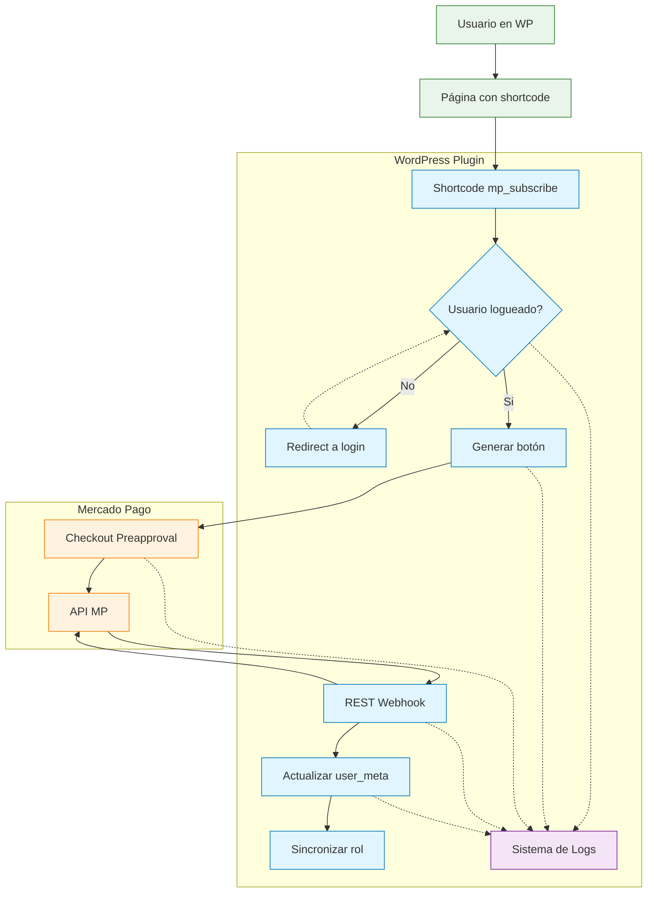

## Flujo de Suscripción y Webhook (WPMPS)

### Visión General
Este diagrama muestra cómo interactúan los componentes del plugin con WordPress y Mercado Pago durante el flujo de suscripción por preapproval, y dónde se registran los eventos (logger).

### Datos que fluyen
- **payer_email**: del usuario WP logueado (para logging y webhook)
- **preapproval_plan_id**: aportado por el shortcode/bloque
- **checkout_url**: enlace generado a partir de dominio + preapproval_plan_id
- **preapproval_id**: ID devuelto por MP y usado en webhook
- **status**: authorized/paused/cancelled

### Canales de Log (Nuevo Sistema)
- **AUTH**: Eventos de autenticación (login requerido)
- **BUTTON**: Renderización de shortcodes y generación de links
- **CHECKOUT**: Interacciones con API de Mercado Pago
- **WEBHOOK**: Procesamiento de webhooks de MP
- **SUBSCRIPTION**: Cambios de estado y roles de suscripción
- **ADMIN**: Acciones administrativas
- **ERROR**: Errores críticos con códigos específicos

### Seguridad
- Requiere usuario logueado para mostrar el botón (evita accesos anónimos)
- HTTPS en sitio y Webhook
- Sanitización/escape en inputs/outputs y normalización de `plan_id`
- Logger filtra potenciales secretos y no guarda tokens
- Ring buffer de 500 eventos máximo para evitar crecimiento descontrolado
