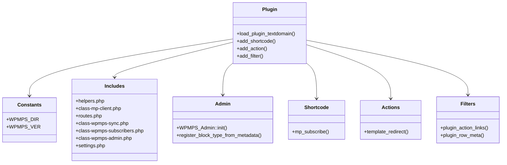

```mermaid
classDiagram
    class Plugin {
        +load_plugin_textdomain()
        +add_shortcode()
        +add_action()
        +add_filter()
    }

    class Constants {
        +WPMPS_DIR
        +WPMPS_VER
    }

    class Includes {
        +helpers.php
        +class-mp-client.php
        +routes.php
        +class-wpmps-sync.php
        +class-wpmps-subscribers.php
        +class-wpmps-admin.php
        +settings.php
    }

    class Admin {
        +WPMPS_Admin::init()
        +register_block_type_from_metadata()
    }

    class Shortcode {
        +mp_subscribe()
    }

    class Actions {
        +template_redirect()
    }

    class Filters {
        +plugin_action_links()
        +plugin_row_meta()
    }

    Plugin --> Constants
    Plugin --> Includes
    Plugin --> Admin
    Plugin --> Shortcode
    Plugin --> Actions
    Plugin --> Filters
```